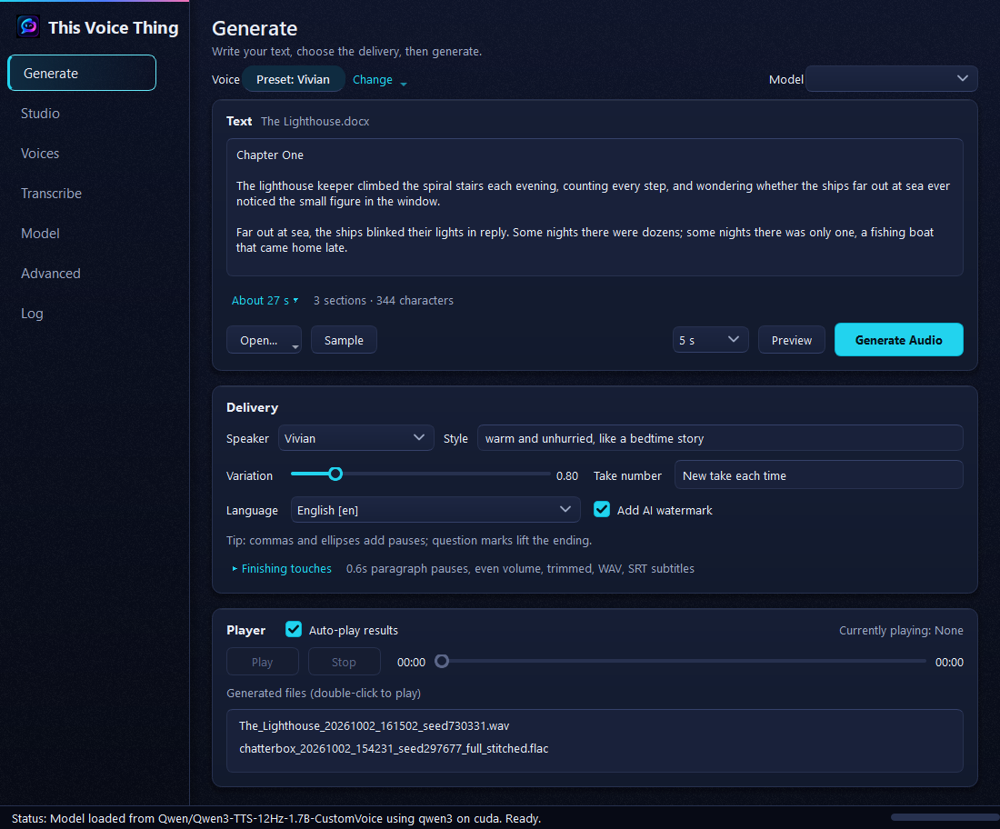
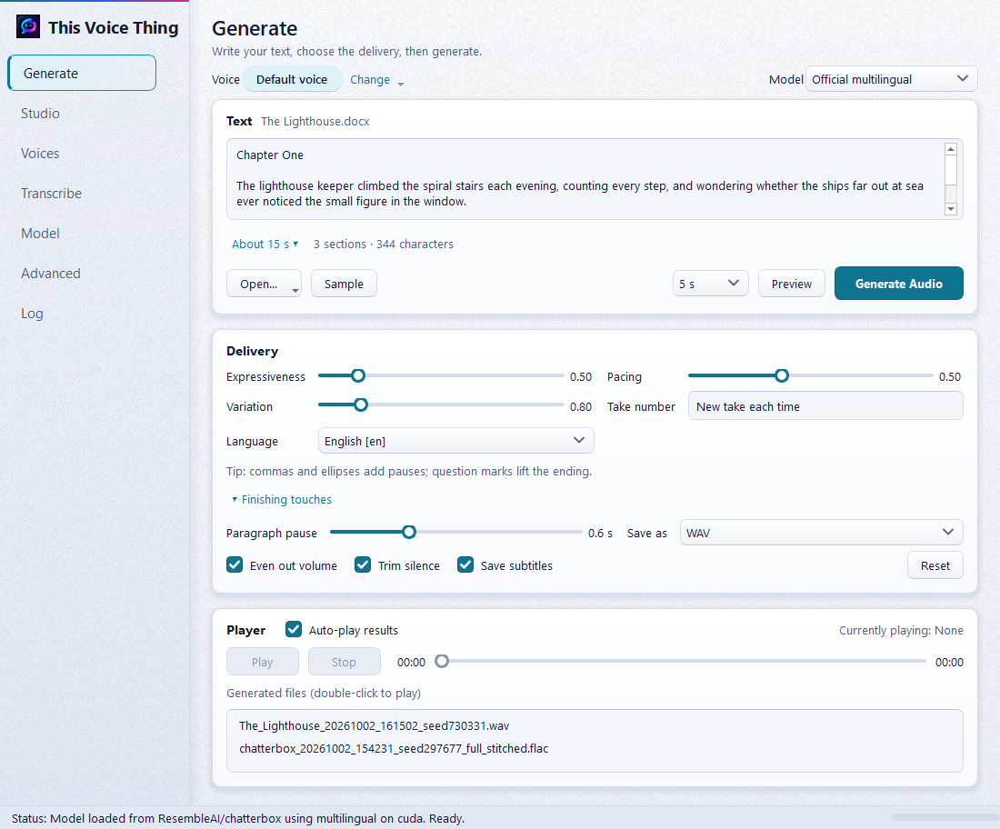
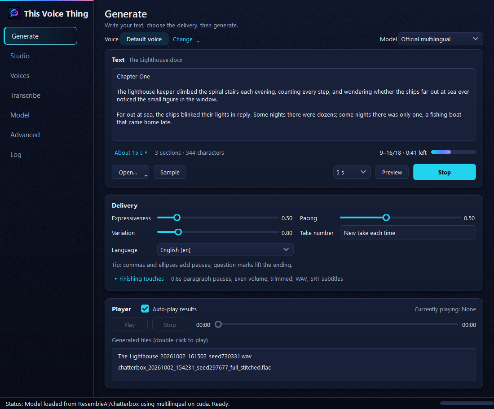
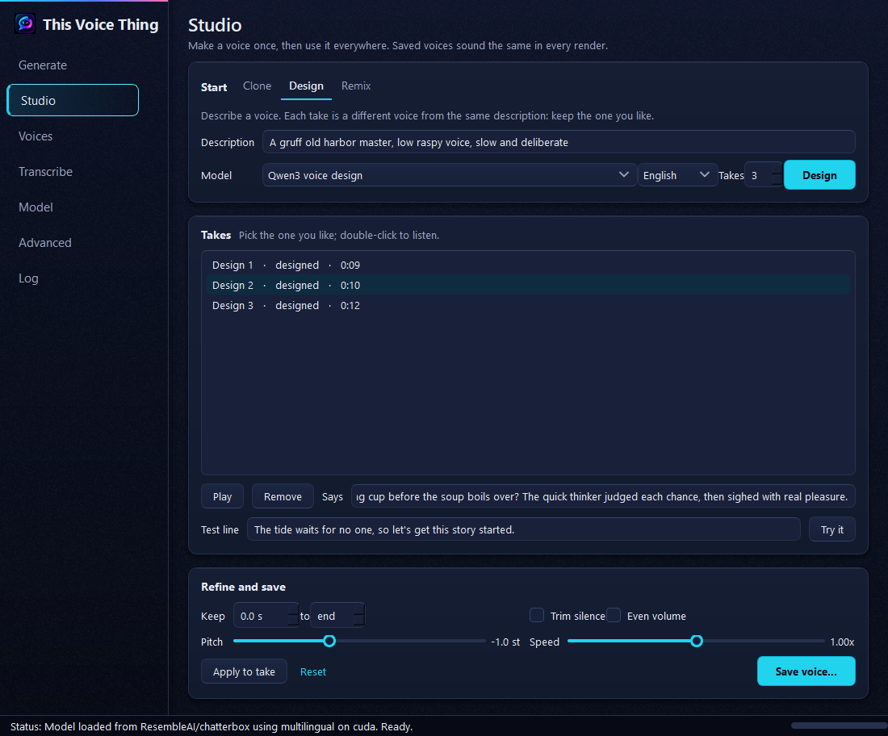
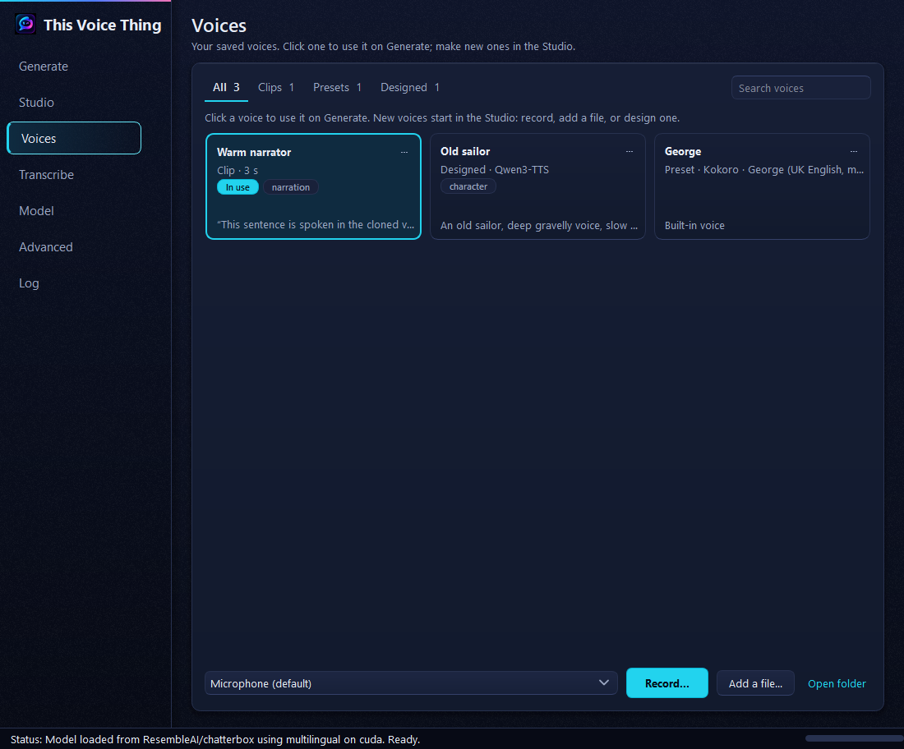
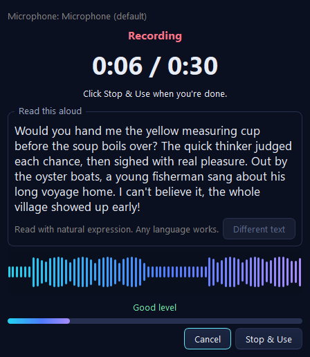
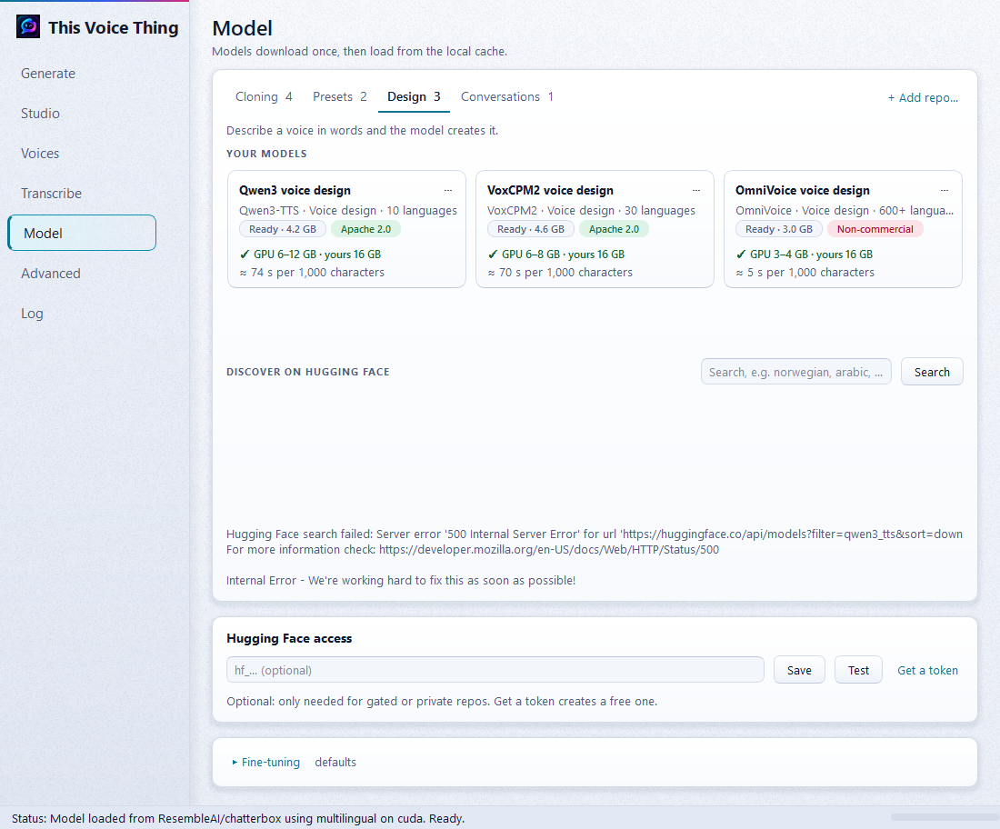
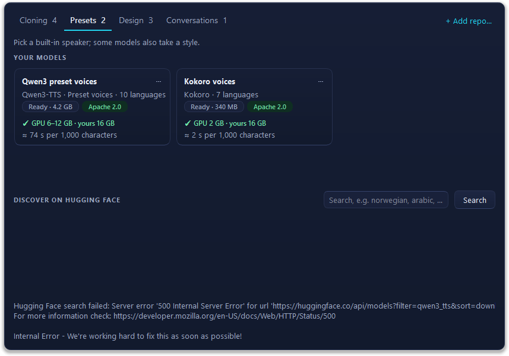
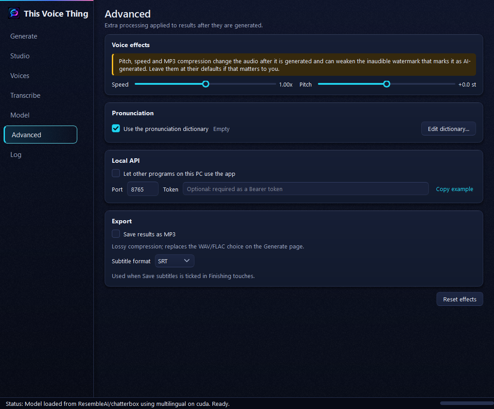

# This Voice Thing


> **Definitely not just Chatterbox UI.**  
> **All the good names were taken.**  
> **A name was apparently required, so here we are.**

**This Voice Thing** is a Windows-first, local-first desktop app for working with voice AI models.

It started as a fork of [AcTePuKc/Chatterbox-TTS-UI](https://github.com/AcTePuKc/Chatterbox-TTS-UI), which itself provides a UI around Resemble AI's open-source [Chatterbox TTS](https://github.com/resemble-ai/chatterbox). Then we kept building things into it. And building. And building. At some point it stopped being particularly reasonable to keep calling the whole application “Chatterbox UI.”

So this is **This Voice Thing**.

You may also think of it as **Not Chatterbox**, **Name Required**, **Good Names Taken**, or **That Voice App We Apparently Had To Name**. Those are not separate editions. Naming software is simply a deeply unserious activity and we have chosen to stop pretending otherwise.

Underneath the stupid name is a fairly serious voice workbench: six local speech engines, voice cloning and design, preset voices, multi-speaker conversations, document narration, model discovery and management, a reusable voice library, pronunciation controls, subtitles, speech-to-text transcription, audio finishing tools, and a local API.

| Engine | From | Does |
| --- | --- | --- |
| **Chatterbox** | Resemble AI | Voice cloning, 23 languages (the default, and the project's ancestor) |
| **Qwen3-TTS** | Alibaba | Preset voices with styles, voice design, voice cloning |
| **VoxCPM2** | OpenBMB | Voice cloning with styles, voice design, 30 languages at 48 kHz |
| **OmniVoice** | k2-fsa | Fast voice cloning and design in 600+ languages (non-commercial weights) |
| **VibeVoice** | Microsoft Research | Multi-speaker conversations (research use) |
| **Kokoro** | hexgrad | Dozens of fast preset voices, light on hardware |

Transcription (audio to text) runs locally too, with OpenAI's open [Whisper large-v3 turbo](https://huggingface.co/openai/whisper-large-v3-turbo).

Text, recordings, generated audio, saved voices and model configuration stay on your machine unless you explicitly use a feature that talks to an external service, such as Hugging Face discovery/downloads or Google Docs import.

> [!NOTE]
> The repository was renamed from `Knapp-Kevin/Chatterbox-TTS-UI` to `Knapp-Kevin/this-voice-thing`; GitHub redirects the old URLs, so existing clones keep working. Chatterbox is one of the supported engines and the project this fork grew from. Runtime folders such as `chatterbox_outputs/` keep their names so existing files and scripts aren't stranded.

See [CHANGELOG.md](CHANGELOG.md) for the long version of how this got out of hand.

## Table of Contents

- [Quick Start](#quick-start)
- [Screenshots](#screenshots)
- [How This Got Out of Hand](#how-this-got-out-of-hand)
- [Features](#features)
- [Local API](#local-api)
- [Google Docs sign-in setup](#google-docs-sign-in-setup)
- [Language Support](#language-support)
- [Prerequisites](#prerequisites)
- [Manual Installation](#manual-installation-advanced)
- [Project Structure](#project-structure)
- [Troubleshooting](#troubleshooting)
- [PyTorch & Reproducibility](#important-notes-on-pytorch-installation--reproducibility)
- [Contributing](#contributing)
- [Acknowledgements](#acknowledgements)

## Quick Start

If you are on Windows and just want the app to work, use this section. You do **not** need an OpenAI API key, a Hugging Face account, or prior Python experience for normal local generation.

### 1. Install the two required tools

Install **Python 3.11 or newer** from [python.org](https://www.python.org/downloads/windows/).

During the Python installer, enable **Add python.exe to PATH**. Then open **Command Prompt** and verify:

```bat
python --version
```

The exact system Python version is not important as long as that command works. The launcher uses `uv` to create the app's required Python 3.11 environment.

Next install **uv**, which manages the app's Python environment and packages:

```bat
python -m pip install uv
```

Verify that Windows can find it:

```bat
uv --version
```

If either command says it is not recognized, close and reopen Command Prompt after installation. If it still fails, see [Troubleshooting](#troubleshooting).

> [!NOTE]
> **FFmpeg is optional for initial setup.** Install it later if you want MP3 support and the best speed/pitch processing. The app itself can start without it.

### 2. Download This Voice Thing

Choose **one** method.

**Easiest: download a ZIP**

1. On this GitHub page, click **Code → Download ZIP**.
2. Open the downloaded ZIP.
3. Extract the entire folder somewhere you can keep it, such as `Documents\This Voice Thing`.
4. Open the extracted folder. Do not run the app from inside the ZIP preview.

**Or, if you use Git:**

```bat
git clone https://github.com/Knapp-Kevin/this-voice-thing
cd this-voice-thing
```

### 3. Start the app

Double-click **`run.bat`**.

That is the normal launcher. You do **not** need to run `setup_env.bat` first.

On the first run, the launcher will:

1. create the private `.venv` Python environment used by the app;
2. install the locked Python dependencies;
3. choose and install the appropriate PyTorch build for your hardware;
4. start This Voice Thing;
5. download the default Chatterbox model when it is first needed.

Keep the setup window open while it works. Later launches reuse the environment and are much shorter.

If setup fails, the launcher tells you where the installer log was written. Look in the repo's **`logs`** folder for the newest `installer_*.log`.

### 4. Make your first audio

When the app opens:

1. Go to **Generate**.
2. Type or paste a short sentence into the text box.
3. Keep the default model and voice for the first test.
4. Click **Preview** to make a short sample.
5. If it sounds right, click **Generate Audio**.
6. Play the result in the built-in player. Generated files are also kept under `chatterbox_outputs/`.

Once that works, the rest of the app is safe to explore:

- **Live Voice** speaks typed text directly through a selected audio output, with queue and stop controls.
- **Studio** creates, clones, remixes and refines voices.
- **Voices** stores the voices you save.
- **Transcribe** turns recordings into text.
- **Model** switches engines, installs optional models and discovers compatible Hugging Face models.
- **Advanced** contains pronunciation, audio finishing, export and local API settings.

Optional engines install their own isolated environments when you first choose them. That is expected and prevents their incompatible dependencies from breaking the main app.

### 5. Normal use after installation

After the first successful setup, just double-click **`run.bat`** whenever you want to use the app. The launcher checks the environment, repairs it when needed, and then starts the application.

You normally should **not**:

- activate the virtual environment yourself;
- run `setup_env.bat` separately;
- install packages into `.venv` by hand;
- copy optional-engine packages into the main environment.

Those are troubleshooting or development tasks, not normal use.

### Launchers

- `run.bat`: **Windows users should start here.** It prepares or repairs the environment, then launches the app.
- `setup_env.bat`: setup only. Useful for troubleshooting or development.
- `run.sh` + `setup_env.sh`: best-effort macOS/Linux equivalents, not validated to the same level as Windows.

Windows remains the primary maintained path. Installer decisions are written to `logs/installer_*.log`; start-up problems to `logs/app_startup_*.log`.

## Screenshots



<details>
<summary><strong>Writing and generating</strong>: light mode, document renders</summary>

| Generate (light) | Rendering a long document |
| --- | --- |
|  |  |

</details>

<details>
<summary><strong>Studio</strong>: clone, design and remix voices</summary>



</details>

<details>
<summary><strong>Voices</strong>: voice library and recording</summary>

| Voice library | Recording a reference clip |
| --- | --- |
|  |  |

</details>

<details>
<summary><strong>Transcribe</strong>: speech to text</summary>


</details>

<details>
<summary><strong>Models</strong>: model tiles and Hugging Face discovery</summary>

| Model page (light) | Discover on Hugging Face |
| --- | --- |
|  |  |

</details>

<details>
<summary><strong>Settings</strong>: Advanced page</summary>



</details>

## How This Got Out of Hand

The original Chatterbox UI remains the project's foundation and deserves explicit credit. This fork has simply grown far beyond being a UI for one model.

Current additions include:

- **Six speech engines grouped by capability.** Chatterbox, Qwen3-TTS, VoxCPM2, OmniVoice, VibeVoice and Kokoro provide different combinations of cloning, preset voices, voice design and conversations.
- **Multi-speaker conversations.** VibeVoice performs scripts with a different voice for each speaker.
- **Model-aware hardware guidance.** Model tiles show licensing, expected download size and GPU-memory requirements against the current machine.
- **A voice Studio.** Clone a recording, design a voice from a description (several candidates at once), or remix a voice with words; clean it up, adjust pitch and speed, and save it frozen so it sounds the same in every render.
- **Voice first.** Generate starts from a saved voice, and only offers the models that can speak it.
- **Document narration.** Open long text, documents and Google Docs, preview a few seconds, estimate generation time, render in sensible sections, and keep partial work if generation is stopped.
- **Hugging Face model discovery.** Search compatible models, inspect compatibility and licensing, and add supported repositories without hand-editing configuration files.
- **Transcription.** Turn audio into text with Whisper, save it as text or subtitles, fill in a voice clip's transcript, or send it back to Generate.
- **Pronunciation controls and subtitles.** Maintain a pronunciation dictionary and generate SRT or WebVTT from the known generation timeline.
- **Audio finishing.** Adjust paragraph pauses, even out volume, trim silence, change speed or pitch, and export WAV, FLAC or MP3.
- **Live Voice and a cached TTS soundboard.** Type a line and send the selected voice directly to speakers, headphones or another Windows audio output without first rendering a file. Save useful phrases as persistent soundboard pads; after the first successful render, static pads play from a local WAV cache without waking the model or GPU.
- **A local HTTP API.** Use the same engines and voice library from other software through OpenAI-compatible or native endpoints.
- **A redesigned desktop interface.** Generate, Live Voice, Studio, Voices, Transcribe, Model, Advanced and Log pages with light and dark themes.

In other words, calling the whole thing “Chatterbox UI” eventually became less a name and more a historical anecdote.

## Features

<details>
<summary><strong>Generate</strong></summary>

- **Voice first:** pick a voice with **Change** (one of yours, or a model's built-in voices), and the model list shows only the models that can speak it. A clip or Studio voice works with every cloning model; picking one while a non-cloning model is loaded loads a cloning model for you.
- Per-model time estimates for the current text (click the estimate to compare and switch).
- Plain-language delivery controls, with engine-specific settings where they apply: speaker and style for Qwen, voice per language for Kokoro, style and clip transcript for VoxCPM, and a cast of voices for VibeVoice. Designing a voice happens in the Studio.
- Variation and take-number controls for repeatable takes where supported.
- Language selection based on the active model.
- A built-in player with history, seeking and optional auto-play.

</details>

<details>
<summary><strong>Live Voice</strong></summary>

**Live Voice** is the direct-to-device speech surface. It uses the same loaded voice, model, language and pronunciation settings as Generate, but sends PCM to a selected audio output instead of waiting for a completed file.

- Type a line and click **Speak**, or press **Ctrl+Enter**.
- Submit more lines while speech is active; they are queued in order.
- **Stop current** silences the current utterance immediately and keeps later queued items.
- **Stop all** discards audible buffered audio and clears the queue.
- **Repeat last** resubmits the most recent completed line.
- **Soundboard:** organize pads into persistent named boards, save the composer (or last spoken line) as a named TTS pad, or import a local audio clip. Create, rename, switch and delete boards directly in Live Voice; the active board is restored after restart. Double-click or Trigger any pad to play it.
- **Windows global hotkeys:** assign a modifier shortcut to any soundboard pad so it can fire while Discord, Zoom, a game or another app has focus. Pad shortcuts are scoped to the active board, so different boards can reuse the same layout. Live Voice also has an independent global **Stop All** shortcut that remains active across boards.
- Static TTS pads are cached locally after their first successful generation. A valid cached pad uses no model/GPU and follows the same device, buffering, Stop and resampling path as live speech.
- **Audio clip pads** copy supported local audio into `soundboard/audio/` so the board does not depend on the original Downloads/Desktop path. Clips stream through the same PCM route, monitoring, Stop and hotkey behavior as generated speech and do not require a TTS model. WAV, FLAC, OGG, MP3 and AIFF are offered by the picker; actual decoding follows the installed libsndfile/soundfile support.
- Global shortcuts use the Windows `RegisterHotKey` API rather than a low-level keyboard hook. They require Ctrl, Alt or Shift plus one supported key, reject Windows-reserved F12/Win-key combinations, use no-repeat behavior, and report OS/application conflicts instead of silently stealing a shortcut.
- Pad caches are content-addressed against the phrase, saved voice identity/clip revision, model/mode, language, style, synthesis controls and pronunciation rules. If those change, the UI marks the pad **rebuild needed** instead of silently playing stale audio.
- Deleting a pad garbage-collects cache files that are no longer referenced.
- Choose a **Route**: **Local output**, **External / virtual microphone**, **Discord**, **Zoom**, **OBS**, or **Other app**. Each profile remembers its own primary output and optional monitor device.
- External routes start **DISARMED** every time the app launches and must be armed explicitly before Speak or a soundboard pad can transmit to them.
- Pick any audio output exposed by Windows/Qt, including speakers, headphones and compatible virtual audio-cable playback devices. Common virtual-device names are labeled as likely virtual, but the app does not require a specific vendor.
- Enable **Also let me hear it through** to monitor the same PCM through a second device such as headphones. The monitor has an independent audio sink: if it fails or disappears, the primary external route continues.
- **Use as microphone** shows a conservative best-effort match for the recording side of a recognized virtual cable. When a match exists, **Copy microphone name** puts the exact endpoint name on the clipboard.
- **Setup…** shows app-specific instructions for Discord, Zoom, OBS, or a generic target application.
- For Discord/Zoom/OBS/Other app profiles, Live Voice inspects the Windows recording endpoints and shows a conservative **Use as microphone** hint when it can identify the paired side of a known virtual cable. The hint can be copied directly.
- **Setup…** shows app-specific instructions using the currently selected device names. It does not automate or modify third-party application settings.
- **Test route** speaks a short phrase through the active route using the current voice.
- A previously saved primary device that disappears is shown as unavailable. Live Voice does **not** silently fall back to the system speakers.
- The page reports whether the selected item is using **Native streaming**, **Segmented streaming**, **Buffered fallback**, or **Cached** playback.
- VoxCPM2 uses native model streaming. Kokoro uses short segmented generation. Other compatible loaded engines can still speak here after completing the utterance.
- Live playback has its own bounded audio buffer and converts the model's native sample rate when the selected device requires a different supported rate.

This implementation can now route to a normal local device or an **external/virtual-microphone profile**, with optional independent monitoring. It does not install a virtual microphone driver itself. If you already have a virtual audio cable, choose its **playback/input** side under **Send voice to**, arm the external route, and choose the cable's paired **recording/output** side as the microphone in Discord, Zoom, OBS or another application.

For example, with a typical virtual cable:

1. In **Live Voice → Route**, choose **Discord**, **Zoom**, **OBS**, or **External / virtual microphone**.
2. Under **Send voice to**, choose the cable's playback endpoint, often named something like **CABLE Input**.
3. Optionally enable monitoring and choose your headphones.
4. Click **Arm external route**, then **Test route**.
5. In Discord/Zoom/etc., choose the paired recording endpoint, often named something like **CABLE Output**, as the microphone.

Exact names depend on the virtual-audio software. This Voice Thing stores the actual Windows/Qt device ID rather than assuming a vendor naming convention. The app-specific profiles now include guided Discord/Zoom/OBS/Other App setup and conservative virtual-cable microphone pairing hints. Audio-clip pads, multiple-board management and global hotkeys remain later slices.

The desktop Live Voice path does **not** call the local HTTP API. Both surfaces consume the same underlying model streaming capabilities.

Architecture and implementation planning live in:

- [Live Voice architecture](docs/live-voice-architecture.md)
- [Live Voice product specification](docs/live-voice-product-spec.md)
- [Live Voice adversarial review](docs/live-voice-adversarial-review.md)
- [Live Voice app routing guide](docs/live-voice-app-routing.md)
- [Live Voice app routing guide](docs/live-voice-app-routing.md)

</details>

<details>
<summary><strong>Documents and long text</strong></summary>

- Open `.txt`, `.md` and `.docx` files, or a Google Doc, while keeping the text editable.
- Live duration, section and character estimates.
- **Preview** about 3, 5 or 10 seconds before committing to a long render. **Keep this take** locks the preview's take.
- Progress and time remaining during long renders. Stopping keeps finished sections as a `_partial` file.
- Paragraph-aware sectioning: text is split where a reader would pause, never mid-phrase or across paragraphs, and pauses between sections match the kind of break.

</details>

<details>
<summary><strong>Studio</strong></summary>

One place to make a voice, so generating is just a matter of picking it. Every voice the Studio saves is frozen: a clip plus the words it says. Any cloning model can speak it, and it sounds the same in every render and batch.

- **Clone:** record (with the guided recorder), open a file, or start from a library voice. Fill in what it says with **Transcribe** (Whisper). Use the clip as it is, or have a cloning model (Chatterbox, Qwen3, VoxCPM2, OmniVoice) re-read a passage in that voice for cleaner takes, with Chatterbox's expressiveness and pacing.
- **Design:** describe a voice (or pick OmniVoice attributes) and make 1 to 4 candidates at once with Qwen3, VoxCPM2 or OmniVoice. Each take is a different voice from the same description; keep the one you like, or change the wording and roll again.
- **Remix:** start from a voice and change it with words, such as "older, slower and warmer", using VoxCPM2's styled cloning.
- **Try it:** hear the selected take say any test line before you commit.
- **Refine:** keep just part of a clip, trim silence, even out the volume, and shift pitch or speed (formant-preserving with FFmpeg's Rubber Band). **Apply to take** makes a new take to compare.
- **Save voice** puts the selected take in the library with its name, tags and notes.

</details>

<details>
<summary><strong>Voice library</strong></summary>

The **Voices** page holds your saved voices: search, tag, rename, preview, and click one to use it on Generate. New voices start in the Studio.

- **Clip voices:** recordings or imported audio plus transcript. They work with every cloning model.
- **Preset voices:** built-in voices from engines such as Kokoro or Qwen.
- **Designed and remixed voices:** made in the Studio and saved frozen as a clip, so picking one later, even after restarting the app, renders the same voice every time. **Open in Studio** (in a voice's ⋯ menu) brings any voice back to refine it. **Make clip** turns an older description-only voice into a clip voice.
- Record with countdown, level monitoring, clipping and too-quiet warnings, and phonetically rich read-aloud passages; recordings open in the Studio.

</details>

<details>
<summary><strong>Transcribe</strong></summary>

Speech to text with OpenAI's [Whisper large-v3 turbo](https://huggingface.co/openai/whisper-large-v3-turbo) (MIT license), on your own GPU or CPU. The model downloads once (about 1.6 GB) the first time you transcribe, and the app asks first.

- Open WAV, FLAC, OGG or MP3 (M4A, AAC and others with FFmpeg installed), or use the current voice clip.
- Language detection, or pick one of about 45 languages.
- Optional `[1:05]` timestamps; edit the text before using it.
- **Copy**, **Save text…**, or **Save subtitles…** as SRT or WebVTT, timed from the audio.
- **Send to Generate** puts the text (without timestamps) on the Generate page, ready to speak with any voice.
- **Transcribe clip** in a library voice's ⋯ menu fills in the clip's transcript, which Qwen, VoxCPM and OmniVoice cloning use.

On an RTX 5070 Ti, 20 seconds of speech takes about a second once Whisper is loaded. It uses about 1.7 GB of GPU memory. Whisper turbo transcribes; it doesn't translate.

</details>

<details>
<summary><strong>Models</strong></summary>

The Model page organizes engines by capability, in **Cloning**, **Presets**, **Design** and **Conversations** tabs, rather than pretending every speech model works the same way.

Each model tile shows:

- loaded / ready / download state, with the download size;
- license or usage restriction (green permissive, red non-commercial, amber unclear or research-only);
- expected GPU memory against the current machine (green fits, amber runs slower, red too small);
- typical speed, learned from your own runs.

**Discover on Hugging Face** searches for compatible repositories while filtering unsupported conversion formats. **+ Add repo…** lets you inspect a specific repository before downloading anything. A Hugging Face read token can be stored locally for gated or private repositories and higher Hub limits: **Get a token** on the Model page opens [Hugging Face's token page](https://huggingface.co/settings/tokens/new?tokenType=read) with the Read type already chosen.

</details>

<details>
<summary><strong>Engines</strong></summary>

- **Chatterbox** remains the default and the project's direct ancestor. It provides multilingual speech and voice cloning and runs in the main application environment.
- **Qwen3-TTS** supports preset voices, voice design and voice cloning. It runs in its own engine environment because its dependencies conflict with Chatterbox's. Long documents use batched generation, and a designed voice is carried through a document by cloning the first generated section.
- **VoxCPM2** supports voice cloning and voice design with multilingual 48 kHz output. Cloning can be steered with style text, and designed voices stay consistent across longer documents.
- **VibeVoice** performs multi-speaker conversations. Scripts use named turns such as `Linda: ...` and `Thomas: ...`, with a cast of sample or user-provided voices. MIT-licensed, but Microsoft's model card limits it to research use; review it before use.
- **OmniVoice** offers fast multilingual voice cloning and attribute-based voice design. Its pretrained weights are non-commercial (CC BY-NC 4.0); review the license before use.
- **Kokoro** is a small, fast preset-voice engine with multiple languages and low hardware requirements. It doesn't clone voices or take free-form style instructions.

Optional engines install themselves into their own `engines/<name>/.venv` the first time you load one of their models.

</details>

<details>
<summary><strong>Finishing touches and Advanced</strong></summary>

- Paragraph pause control, volume levelling and start/end silence trimming.
- WAV, FLAC and optional MP3 output.
- Speed and pitch adjustment (formant-preserving with FFmpeg's Rubber Band).
- SRT and WebVTT subtitles, timed from the generation itself.
- A pronunciation dictionary with import/export and auditioning.
- An optional inaudible AI watermark on engines that don't add one themselves.

</details>

## Local API

Other programs on the same PC can use the app's models and voices. Enable it under **Advanced → Local API**. The server listens only on `127.0.0.1` (port `8765` by default) and can require a bearer token. Speech requests use the same pipeline as the desktop UI: model selection, sectioning, batching, voice handling, pronunciation and finishing. It can also transcribe audio.

<details>
<summary><strong>Examples</strong></summary>

OpenAI-compatible speech endpoint (works with tools that already speak the OpenAI speech API):

```bash
curl http://127.0.0.1:8765/v1/audio/speech \
  -H "Content-Type: application/json" \
  -d '{"input":"Hello from my own computer.","voice":"alloy","response_format":"mp3"}' \
  -o speech.mp3
```

Native endpoint, with any model, library voice and subtitles:

```bash
curl http://127.0.0.1:8765/v1/speech \
  -H "Content-Type: application/json" \
  -d '{"text":"Chapter one...","model":"Kokoro voices","voice":"george","subtitles":"srt","format":"flac","name":"chapter1"}'
```

OpenAI-compatible transcription (Whisper must have been downloaded once from the Transcribe page):

```bash
curl http://127.0.0.1:8765/v1/audio/transcriptions \
  -F file=@interview.wav -F language=en -F response_format=srt
```

`response_format` is `json` (default), `text`, `srt`, `vtt` or `verbose_json` (with timed segments).

Discovery endpoints: `GET /v1/health`, `GET /v1/models`, `GET /v1/voices`.

### Experimental live PCM streaming

The local API and the desktop Live Voice page share the same live model capabilities.

- **VoxCPM2 · native:** returns acoustic PCM chunks while one utterance is still being generated.
- **Kokoro · segmented:** generates short speech sections and returns each completed section while later sections continue.

The API remains useful for other programs; the desktop Live Voice page consumes the model stream directly and does not loop back through HTTP.

For VoxCPM2 voice cloning:

```bash
curl http://127.0.0.1:8765/v1/audio/speech \
  -H "Content-Type: application/json" \
  -d '{"model":"VoxCPM2 voice cloning","input":"Hello while I am still being generated.","voice":"YOUR CLIP VOICE","stream":true,"stream_format":"audio","response_format":"pcm"}' \
  --no-buffer > speech.pcm
```

The stream is mono signed 16-bit little-endian PCM at the model's native sample rate (48 kHz for VoxCPM2, 24 kHz for Kokoro). Response headers include `X-Audio-Sample-Rate`, `X-Audio-Sample-Format`, `X-Streaming-Mode` (`native` or `segmented`) and `X-Audio-Watermark`.

Live output intentionally does **not** run whole-waveform finishing such as speed/pitch processing, final global volume levelling or subtitle alignment. VoxCPM2's raw native path also does not currently apply the normal Perth watermark. Kokoro's segmented path retains its existing per-section watermark and the app's clause/sentence/paragraph seam pauses. Streaming currently requires `speed=1.0` and raw PCM output; the API rejects incompatible options rather than silently changing their meaning.

To measure actual latency and sustained throughput on the current machine:

```bash
python scripts/benchmark_live_api.py --model "VoxCPM2 voice cloning" --voice "YOUR CLIP VOICE"
```

The benchmark reports time to first audio (TTFA), real-time factor (RTF), and on the cancellation branch how quickly a disconnected stream releases the generation slot. RTF below 1.0 means synthesis stays ahead of playback; lower is better.

The architecture, live-mode definitions, provenance policy, validation gates and planned merge order are documented in [docs/live-tts-architecture.md](docs/live-tts-architecture.md).

</details>

## Google Docs sign-in setup

Shared Google Doc links work without signing in. Opening your private Docs needs a Google OAuth desktop client, set up once:

<details>
<summary><strong>Setup steps</strong> (about 5 minutes)</summary>

1. Create a project in [Google Cloud Console](https://console.cloud.google.com/).
2. Enable the **Google Drive API**.
3. Configure the Google Auth Platform branding/audience and add your account as a test user if the app remains in testing.
4. Create a **Desktop app** OAuth client and download its JSON file.
5. In This Voice Thing, choose **Open... → From Google Docs... → Set up...**, select that JSON file, then sign in.

The app requests read-only Drive access. Local auth information is stored in `google_auth.json`. While the Cloud project is in **Testing**, Google ends sign-ins after 7 days; setting it to **In production** avoids that, with an "unverified app" warning that's expected for an app only you use.

</details>

## Language Support

<details>
<summary><strong>Languages by engine</strong></summary>

- **Chatterbox multilingual:** Arabic, Danish, German, Greek, English, Spanish, Finnish, French, Hebrew, Hindi, Italian, Japanese, Korean, Malay, Dutch, Norwegian, Polish, Portuguese, Russian, Swedish, Swahili, Turkish and Chinese.
- **Qwen3-TTS:** English, Chinese, Japanese, Korean, German, French, Russian, Portuguese, Spanish and Italian.
- **VoxCPM2:** 30 languages plus several Chinese dialects.
- **OmniVoice:** 600+ languages.
- **VibeVoice:** English and Chinese.
- **Kokoro:** US/UK English, Spanish, French, Hindi, Italian, Brazilian Portuguese and Mandarin.

Community fine-tunes may add other languages. Use **Check** before assuming a Hugging Face repository is compatible.

</details>

## Prerequisites

<details>
<summary><strong>Software, hardware and disk space</strong></summary>

1. **Windows:** a working Python installation available as the `python` command. Python 3.11 or newer is the simplest choice. The maintained launcher creates its own Python 3.11 environment with `uv`.
2. **`uv`:** install with `python -m pip install uv`, then verify with `uv --version`. The [official uv installation guide](https://github.com/astral-sh/uv#installation) has alternative installation methods.
3. **NVIDIA GPU recommended.** CPU operation is possible for some engines but considerably slower. A GPU is not required merely to install or open the application.
4. **FFmpeg recommended, not required for first launch.** It enables broader audio-format support plus higher-quality speed/pitch processing.
5. **Disk space:** allow substantial room for PyTorch environments and model weights. Individual engines and models can take several gigabytes each. Do not assume the source-code download size represents the installed size.
6. **Internet access** for initial setup and model downloads. Generation runs offline afterwards for models already installed.
7. **No cloud API key required for normal local use.** Hugging Face authentication is optional unless you choose gated/private models or want higher Hub limits.

Approximate GPU memory, as a starting point (each model tile compares its needs with your GPU):

| Engine/model | Approximate VRAM guidance |
| --- | --- |
| Kokoro | ~2 GB |
| OmniVoice | 3–4 GB |
| Chatterbox | 4 GB minimum, ~6 GB comfortable |
| VoxCPM2 | ~6 GB minimum, ~8 GB comfortable |
| VibeVoice 1.5B | ~8 GB minimum, ~10 GB comfortable |
| Qwen3 0.6B | ~4 GB minimum |
| Qwen3 1.7B | ~6 GB minimum, more for full batching |

</details>

## Manual Installation (Advanced)

<details>
<summary><strong>Manual setup</strong> (macOS/Linux, or if the launcher fails)</summary>

`run.sh` and `setup_env.sh` mirror the launcher pattern for macOS/Linux but remain best-effort. Manual setup is the safer fallback outside Windows.

```bash
uv venv .venv --python 3.11
```

Activate the environment:

```bash
# Windows
.\.venv\Scripts\activate

# macOS/Linux
source .venv/bin/activate
```

Then:

```bash
uv pip sync requirements.lock.txt
python scripts/install_torch.py
python main.py
```

Optional engines install into their own `engines/<name>/.venv` environments from inside the app. Do not casually merge their Python dependencies into the main environment; several require mutually incompatible library versions, because dependency resolution apparently needed its own contribution to the comedy.

</details>

## Project Structure

<details>
<summary><strong>Where things live</strong></summary>

```
this-voice-thing/
├─ main.py                      start here: `python main.py` (run.bat / run.sh call it)
├─ run.bat, setup_env.bat       Windows launcher and setup (maintained)
├─ run.sh, setup_env.sh         macOS/Linux launcher and setup (best effort)
├─ this_voice_thing/            the application package
│  ├─ app.py                    start-up wrapper and crash logging
│  ├─ paths.py                  where code and data live
│  ├─ ui/
│  │  ├─ main_window.py         the window: sidebar, page layout, settings (run as __main__)
│  │  ├─ pages/                 one module per page, mixed into the window:
│  │  │                         generate, generation, live_voice, documents, estimates, finishing, engine_controls, player,
│  │  │                         studio, voice, voice_picker, library, voice_use, recording, transcribe, models, discover, model_loading,
│  │  │                         model_settings, advanced, api_server, pronunciations
│  │  ├─ dialogs/               recording, find/add models, voices and cast, pronunciation, Google Docs
│  │  ├─ threads.py             model loading, generation, installs, speech and transcription threads
│  │  ├─ live_audio.py          QAudioSink streaming playback, buffering and sample-rate conversion
│  │  ├─ global_hotkeys.py      Windows RegisterHotKey manager for pads and Stop All
│  │  ├─ api_bridge.py          hands local API requests to the window
│  │  ├─ common.py              start-up setup, model config and shared constants
│  │  ├─ widgets.py             small reusable widgets
│  │  ├─ theme.py               light/dark theme and its semantic colour tokens
│  │  └─ tiles.py               model and voice tiles
│  ├─ engines/
│  │  ├─ chatterbox_backend.py  Chatterbox, loaded in-process
│  │  ├─ worker.py              shared worker/environment support for the other engines
│  │  └─ qwen.py, kokoro.py, voxcpm.py, omnivoice.py, vibevoice.py
│  ├─ core/
│  │  ├─ live_voice.py          shared live/cached/audio-file speech sessions and typed PCM AudioFrame
│  │  ├─ live_routes.py         persistent route profiles and virtual-device hints
│  │  ├─ soundboard.py          named boards, TTS/audio pads, hotkeys and content-addressed local WAV cache
│  │  ├─ model_registry.py      engines, capabilities, licenses, hardware needs, Hugging Face discovery
│  │  ├─ documents.py           document loading, sectioning, conversation scripts
│  │  ├─ audio_effects.py       joining, finishing, speed/pitch, export
│  │  ├─ subtitles.py           SRT/WebVTT from the render timeline
│  │  ├─ pronunciation.py       pronunciation dictionary
│  │  ├─ transcription.py       speech to text with Whisper
│  │  ├─ voice_studio.py        designing, cloning, remixing and refining voices for the Studio
│  │  └─ voice_library.py       saved clip, preset and designed voices
│  └─ integrations/
│     ├─ local_api.py           local OpenAI-compatible and native HTTP API
│     └─ google_docs.py         Google Docs import and sign-in
├─ engines/<name>/              engine worker scripts, plus their own .venv once installed
├─ scripts/install_torch.py     picks a PyTorch build for your hardware (run by setup)
├─ scripts/restart_app.py      closes the app gracefully (it saves its settings) and starts it again
├─ tests/                       automated tests (`python -m unittest discover tests`)
├─ assets/                      icons and branding (assets/branding/)
├─ docs/screenshots/            README screenshots
├─ models.json                  the model list
└─ requirements.in, requirements.lock.txt, uv.toml
```

Your data stays in the project folder, where it has always been: `app_settings.json`, `models.json`, `chatterbox_outputs/`, `reference_recordings/`, `voice_library/`, `pronunciations.json`, `google_auth.json`, `logs/`, `.venv/` and each engine's `engines/<name>/.venv/`. Those names are kept for compatibility even though the app is now This Voice Thing.

</details>

## Troubleshooting

<details>
<summary><strong>Common problems</strong></summary>

- **First launch appears stuck:** model and PyTorch downloads can take time. Check the Log page and `logs/`.
- **NVIDIA GPU exists but CPU is selected:** verify `nvidia-smi`, delete `.venv\.torch_checked`, then rerun `run.bat`.
- **Broken environment:** delete `.venv` and let the launcher rebuild it.
- **macOS/Linux launcher failure:** use the manual installation flow; shell support is still best-effort.
- **Window never appears:** inspect the newest `logs/app_startup_*.log`.
- **Microphone unavailable:** verify the device and Windows desktop-app microphone permissions.
- **Custom Hugging Face repo fails:** run **Check** in the model editor before downloading. GGUF, ONNX, MLX and partial fine-tunes are not necessarily drop-in compatible.
- **Unauthenticated Hugging Face warning:** optional. If you want one, **Get a token** on the Model page creates a free read token; paste it in and Save.

</details>

## Important Notes on PyTorch Installation & Reproducibility

<details>
<summary><strong>Why PyTorch is installed separately</strong></summary>

The project uses two deliberately separate mechanisms:

1. `requirements.lock.txt` keeps the main application's Python dependencies pinned.
2. `scripts/install_torch.py` selects a PyTorch runtime appropriate for the machine instead of pretending one wheel can sensibly serve every NVIDIA generation and CPU-only installation.

Optional engines use isolated environments where their dependencies conflict with the main application or each other. This costs disk space but avoids turning the primary environment into dependency soup.

</details>

## Contributing

Issues and pull requests are welcome for application behavior, installer reliability, UI/UX, model compatibility, documentation and additional engines. See [CONTRIBUTING.md](CONTRIBUTING.md).

Please keep model licensing, attribution, local/private behavior and compatibility claims accurate. The project name may be unserious. Those parts are not.

## Acknowledgements

**This Voice Thing is based on Chatterbox-TTS-UI.** The rename does not erase the project's lineage, upstream work or licenses.

- **AcTePuKc** for the original [Chatterbox-TTS-UI](https://github.com/AcTePuKc/Chatterbox-TTS-UI) this fork builds on (MIT), and [lowkeytea](https://github.com/lowkeytea) for [their contributions](https://github.com/AcTePuKc/Chatterbox-TTS-UI/commits?author=lowkeytea) to it.
- **Resemble AI** for [Chatterbox TTS](https://github.com/resemble-ai/chatterbox) (MIT).
- **Alibaba / the Qwen team** for [Qwen3-TTS](https://github.com/QwenLM/Qwen3-TTS) (Apache-2.0).
- **OpenBMB** for [VoxCPM](https://github.com/OpenBMB/VoxCPM) (Apache-2.0).
- **Microsoft Research** for [VibeVoice](https://github.com/microsoft/VibeVoice) and its associated research/model work.
- **k2-fsa / Xiaomi** for [OmniVoice](https://github.com/k2-fsa/OmniVoice) (code Apache-2.0; review the model weights' separate license).
- **hexgrad** for [Kokoro](https://huggingface.co/hexgrad/Kokoro-82M) and its [misaki](https://github.com/hexgrad/misaki) text front end (Apache-2.0).
- The developers and maintainers of PySide6, NLTK, PyTorch, librosa, FFmpeg, Rubber Band, `uv`, and the rest of the stack that makes this ridiculous thing work.

## Contributors ✨

Thanks goes to these wonderful people:

<!-- ALL-CONTRIBUTORS-LIST:START - Do not remove or modify this section -->
<!-- prettier-ignore-start -->
<!-- markdownlint-disable -->
<table>
  <tbody>
    <tr>
      <td align="center" valign="top" width="14.28%"><a href="https://github.com/Knapp-Kevin"><br /><sub><b>Kevin Knapp</b></sub></a><br /><a href="https://github.com/Knapp-Kevin/this-voice-thing/commits?author=Knapp-Kevin" title="Code">💻</a> <a href="#ideas-Knapp-Kevin" title="Ideas, Planning, & Feedback">🤔</a> <a href="#design-Knapp-Kevin" title="Design">🎨</a> <a href="https://github.com/Knapp-Kevin/this-voice-thing/commits?author=Knapp-Kevin" title="Documentation">📖</a> <a href="#projectManagement-Knapp-Kevin" title="Project Management">📆</a></td>
    </tr>
  </tbody>
</table>

<!-- markdownlint-restore -->
<!-- prettier-ignore-end -->
<!-- ALL-CONTRIBUTORS-LIST:END -->

This project follows the [all-contributors](https://github.com/all-contributors/all-contributors) specification. Contributions of any kind welcome!
